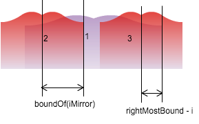

[5. Longest Palindromic Substring](https://leetcode.com/problems/longest-palindromic-substring/)

[![java]](../java/005-longest-palindromic-substring.md)
[![cpp]](../cpp/005-longest-palindromic-substring.md)
[![c]](../c/005-longest-palindromic-substring.md)
[![csharp]](../csharp/005-longest-palindromic-substring.md)
[![ruby]](../ruby/005-longest-palindromic-substring.md)
[![python]](../python/005-longest-palindromic-substring.md)
[![js]](../js/005-longest-palindromic-substring.md)
[java]: ../images/java-logo.png
[cpp]: ../images/cpp-logo.png
[c]: ../images/c-logo.png
[csharp]: ../images/csharp-logo.png
[ruby]: ../images/ruby-logo.png
[python]: ../images/python-logo.png
[js]: ../images/js-logo.png

- [prev: 4. Median of Two Sorted Arrays](004-median-of-two-sorted-arrays.md)
- [next: 6. ZigZag Conversion](006-zigzag-conversion.md)

---

## Naive solution
naive solution just shifting the center index and do O(n) expanding search on it.
```java
// Time: O(n^2)
// Space: O(1)
// Runtime: 11ms
public class Solution {

    public String (String s) {
        if (s.isEmpty()) return "";
        char[] ary = s.toCharArray();
        int lo = 0;
        int hi = 0;
        int leap = 1;
        for (int center = 0, i = 0, symmetric = i; i <= ary.length; i++, symmetric--) {
            if (symmetric < 0 || i >= ary.length || ary[symmetric] != ary[i]) {
                if (i - symmetric - 1 > hi - lo) {
                    lo = symmetric + 1;
                    hi = i;
                }
                center += leap;
                symmetric = i = center;
                leap = 1;
            }
            if (symmetric == center) {
                while (i + 1 < ary.length && ary[i] == ary[i + 1]) { i++; leap++; }
            }
        }
        return s.substring(lo, hi);
    }
}
```

corner cases:
- undeterministic center: might be "a" or "aa", so just skip all identical chars in the center

optimization:
- cache the length of duplicated central chars so that center index can jump through them
- worst case: "abababababababababababababababababa..."

## [Manacher's Algorithm](https://github.com/cbsheng/fun_acm/blob/master/blog/%E6%B1%82%E6%9C%80%E9%95%BF%E5%9B%9E%E6%96%87%E5%AD%90%E4%B8%B2%E4%B9%8BManacher%E7%AE%97%E6%B3%95.md)
[Wikipedia](https://en.wikipedia.org/wiki/Longest_palindromic_substring#Manacher.27s_algorithm)



The principle is to use dynamic programming to reuse former info. The redundancy lies in the overlapping part between palindrom #1 and #3, given #1 and #2 are known.

Let `rightMostBoundary` be the right most palindrome boundary iterated. If a palindrome's center is inside the `rightMostBoundary`, then itself's boudary is at least (the minimum of):

1. length between its center to `rightMostBoundary`
2. palindrome boundary of its mirror point.

```java
import java.util.Arrays;

// Time: O(n)
// Space: O(4n)
public class Solution {
    public String longestPalindrome(String s) {
        if (s == null || s.length() == 0) return "";

        char[] boundedArray = buildBoundaries(s.toCharArray());
        int[] boundOf = new int[boundedArray.length];
        int center = 0, rightMostBound = 0;
        for (int i = 1; i < boundedArray.length - 1; i++) {
            int iMirror = center * 2 - i;
            // when inside a upper palindrome:
            // least bound length of i shall be
            // overlapping length [i, upper palindrome's right most boundary)
            // or bound of its mirror.
            boundOf[i] = rightMostBound > i ?
                    Math.min(rightMostBound-i, boundOf[iMirror]) : 0;
            // normal expanding
            while (boundedArray[i + 1 + boundOf[i]] ==
                    boundedArray[i - 1 - boundOf[i]]) {
                boundOf[i]++;
            }
            if (i + boundOf[i] > rightMostBound) {
                center = i;
                rightMostBound = i + boundOf[i];
            }
        }
        // find the biggest boundary
        int maxBoundary = 0;
        int centerIdx = 0;
        for (int i = 0; i < boundOf.length; i++) {
            if (boundOf[i] > maxBoundary) {
                maxBoundary = boundOf[i];
                centerIdx = i;
            }
        }
        char[] longest = Arrays.copyOfRange(boundedArray, centerIdx-maxBoundary, centerIdx+maxBoundary+1);
        return stripBoundaries(longest);
    }

    private char[] buildBoundaries(char[] cs) {
        if (cs == null || cs.length == 0) { return "^||$".toCharArray(); }

        char[] boundedArray = new char[cs.length * 2 + 3];
        boundedArray[0] = '^';
        int idx = 1;
        for (char c : cs) {
            boundedArray[idx++] = '|';
            boundedArray[idx++] = c;
        }
        boundedArray[idx++] = '|';
        boundedArray[idx] = '$';
        return boundedArray;
    }

    private String stripBoundaries(char[] boundedArray) {
        if (boundedArray == null || boundedArray.length <= 2) return "";

        char[] striped = new char[(boundedArray.length-1)/2];
        for (int i = 0, from = 1; i < striped.length; i++, from += 2) {
            striped[i] = boundedArray[from];
        }
        return String.valueOf(striped);
    }
}
```

---

- [prev: 4. Median of Two Sorted Arrays](004-median-of-two-sorted-arrays.md)
- [next: 6. ZigZag Conversion](006-zigzag-conversion.md)
