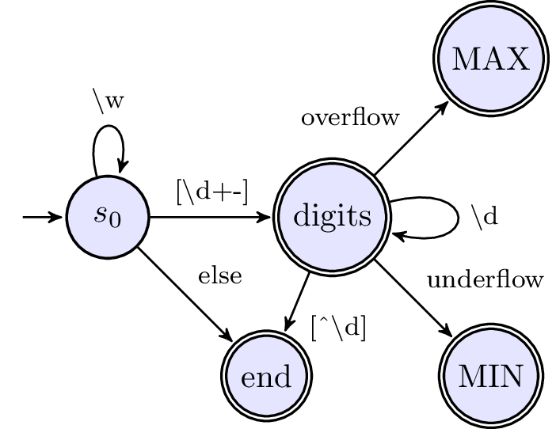

[008. String to Integer (atoi)](https://leetcode.com/problems/string-to-integer-atoi/)

[![java]](../java/008-string-to-integer-atoi.md)
[![cpp]](../cpp/008-string-to-integer-atoi.md)
[![c]](../c/008-string-to-integer-atoi.md)
[![csharp]](../csharp/008-string-to-integer-atoi.md)
[![ruby]](../ruby/008-string-to-integer-atoi.md)
[![python]](../python/008-string-to-integer-atoi.md)
[![js]](../js/008-string-to-integer-atoi.md)
[java]: ../images/java-logo.png
[cpp]: ../images/cpp-logo.png
[c]: ../images/c-logo.png
[csharp]: ../images/csharp-logo.png
[ruby]: ../images/ruby-logo.png
[python]: ../images/python-logo.png
[js]: ../images/js-logo.png

- [prev: 007. Reverse Integer](007-reverse-integer.md)
- [next: 009. Palindrome Number](009-palindrome-number.md)

---

This problem is not hard in algorithm, but in its complex business logic.
It's more real world code.



```java
public class Solution {
    public int myAtoi(String str) {
        if (str == null || str.isEmpty()) return 0;
        
        long absVal = 0;
        int sign = 1;
        char[] chars = str.toCharArray();
        int len = str.length();
        int idx = 0;
        while (idx < len) {
            char c = chars[idx++];
            if (Character.isSpaceChar(c)) {
            } else if (c == '-') {
                sign = -1;
                break;
            } else if (c == '+') {
                break;
            } else {
                int diff = c - '0';
                if (0 <= diff && diff <= 9) {
                    absVal = diff;
                    break;
                } else {
                    return 0;
                }
            }
        }
        
        while (idx < len) {
            char c = chars[idx++];
            int diff = c - '0';
            if (0 <= diff && diff <= 9) {
                absVal = absVal * 10 + diff;
                if (sign == 1 && absVal > Integer.MAX_VALUE) {
                    return Integer.MAX_VALUE;
                } else if (sign == -1 && -absVal < Integer.MIN_VALUE) {
                    return Integer.MIN_VALUE;
                }
            } else {
                return (int) absVal * sign;
            }
        }
        
        return (int) absVal * sign;
    }
}
```
In fact for such code, modularization is a much better idea comparing to any attempts to simplify it.
(e.g. build a FSA parser to support extensibility)


---

- [prev: 007. Reverse Integer](007-reverse-integer.md)
- [next: 009. Palindrome Number](009-palindrome-number.md)
